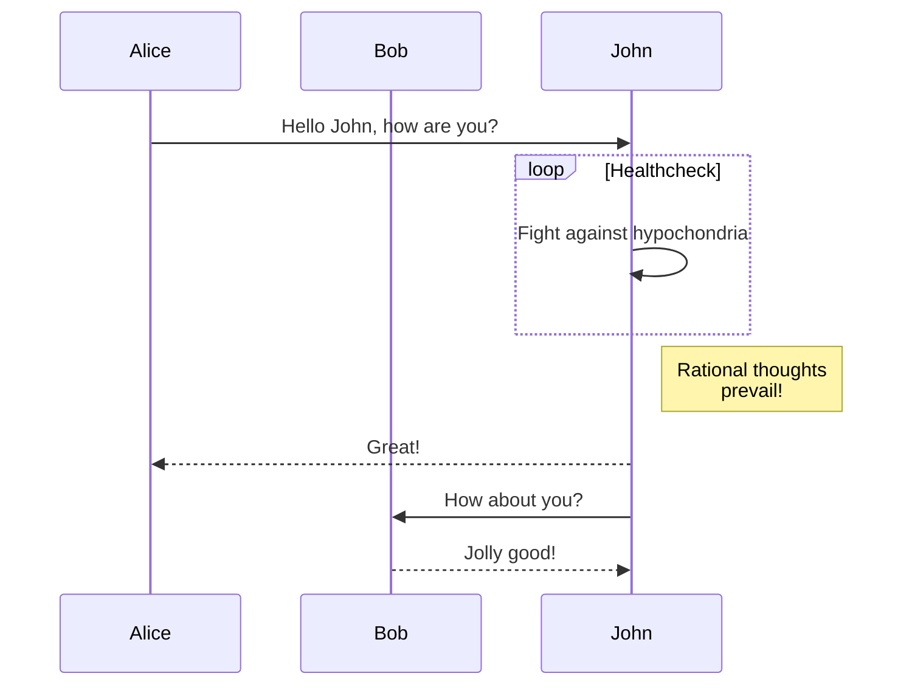

# Mermaid

[Mermaid](https://mermaid.js.org/) es una herramienta que convierte texto y código en diagramas y visualizaciones orientado a desarolladores.

Mermaid nos ayuda a documentar nuestro sistema y nos provee una forma más facil de mantener los diagramas actualizados. Nos reduce el tiempo de cambio de contexto y permite a cualquier persona con un editor de texto poder editar los diagramas.

### Ejemplo:

Diagrama de secuencia  
Código mermaid

```
sequenceDiagram
participant Alice
participant Bob
Alice->>John: Hello John, how are you?
loop Healthcheck
John->>John: Fight against hypochondria
end
Note right of John: Rational thoughts <br/>prevail!
John-->>Alice: Great!
John->>Bob: How about you?
Bob-->>John: Jolly good!
```

Resultado:


