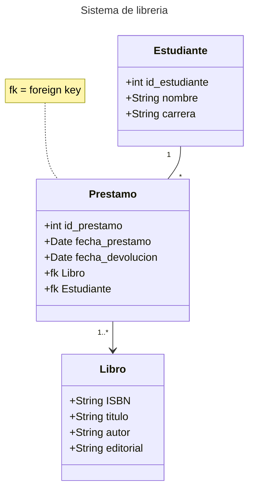

```mermaid

---
title: Sistema de libreria
---
classDiagram
class Libro {
  +String ISBN
  +String titulo
  +String autor
  +String editorial
}

class Estudiante{
+int id_estudiante
+String nombre
+String carrera
}

class Prestamo{
  +int id_prestamo
  +Date fecha_prestamo
  +Date fecha_devolucion
  +fk Libro
  +fk Estudiante
}

Prestamo "1..*" --> Libro
Estudiante "1" -- "*" Prestamo
note for Prestamo "fk = foreign key"
```
