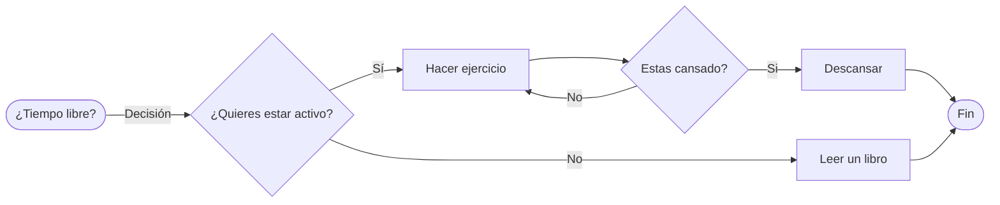

```mermaid
flowchart LR
  A([¿Tiempo libre?]) -->|Decisión| B{¿Quieres estar activo?}
  B -- Sí --> C[Hacer ejercicio]
  C ---> D{Estas cansado?}
  D -- Si --> E[Descansar]
  D -- No --> C
  B -- No --> F[Leer un libro]
  E --> H
  F --> H
  H([Fin])
```
